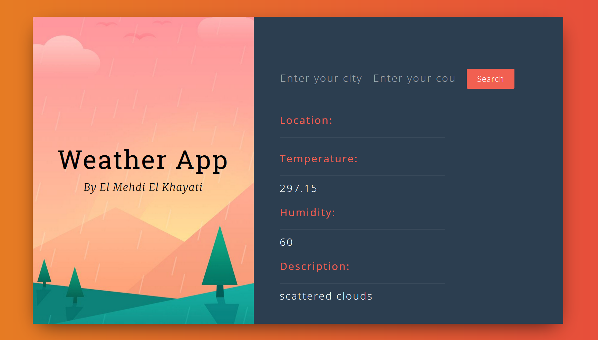

A simple weather app with a beautiful UI, built using ReactJS and Open Weather Map API.

<a href="https://github.com/Kaygi22/React-apps/tree/master/weather-app"><i class="large github icon"> </i> Check gitHub repo.</a>

