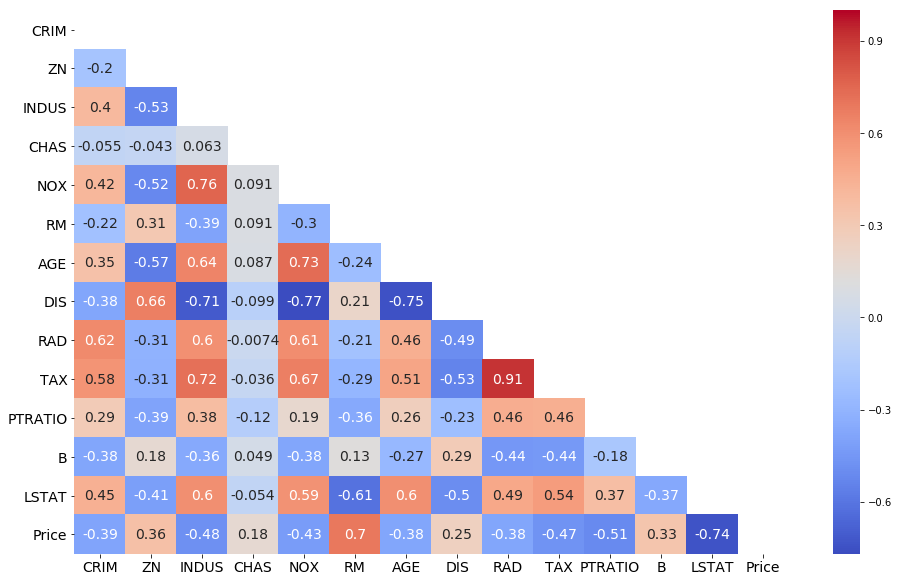
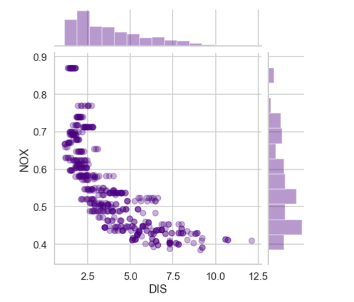

First, data was provided by scikit-learn in python, so I used load_boston dataset.
So the process of analysis was gathering data, exploring data with pandas, cleaning data, visualizing data in histograms, distributions and bar charts, splitting dataset into training and test data, transforming data, analysis and regression optimization. 

You can check all the steps in my notebook uploaded on gitlab.

<a href="https://gitlab.com/Kaygi22/data-science-project"><i class="large gitlab icon"> </i>Project notebook</a>

