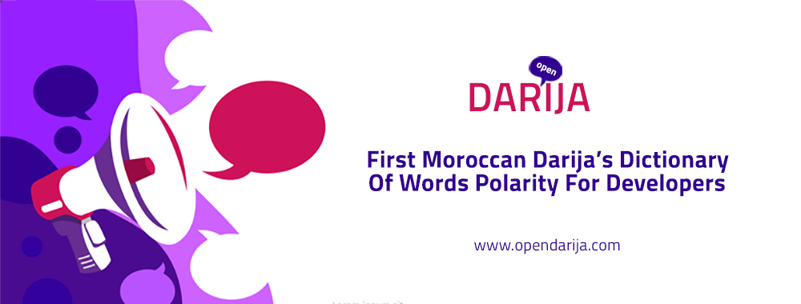

Open Darija is the first Moroccan Dialect's Dictionary of word's polarity for developers. The website designed a front project presentation, that contains a information about the project and a form that display a word and the visitor has to contribute by provide the polarity and the word sentiments. 

A back-end admin dashboard that provide adding words to the factory (words displayed in forms), managing a naive NLP for inserting text in order to extract cleaned words, managing words in dictionary and other features. 

Currently the system is in it's 1.0.3 version.
This project is open source. 

Project was a founded by my colleague  <a href="https://github.com/Touza"><i class="large github icon"></i>Touza</a> and me. 

 <a href="https://www.facebook.com/opendarija/"><i class="large facebook icon"> </i> Check facebook page content: </a>

<a href="https://github.com/Open-darija"><i class="large github icon"> </i> Open Darija GitHub page:  </a>