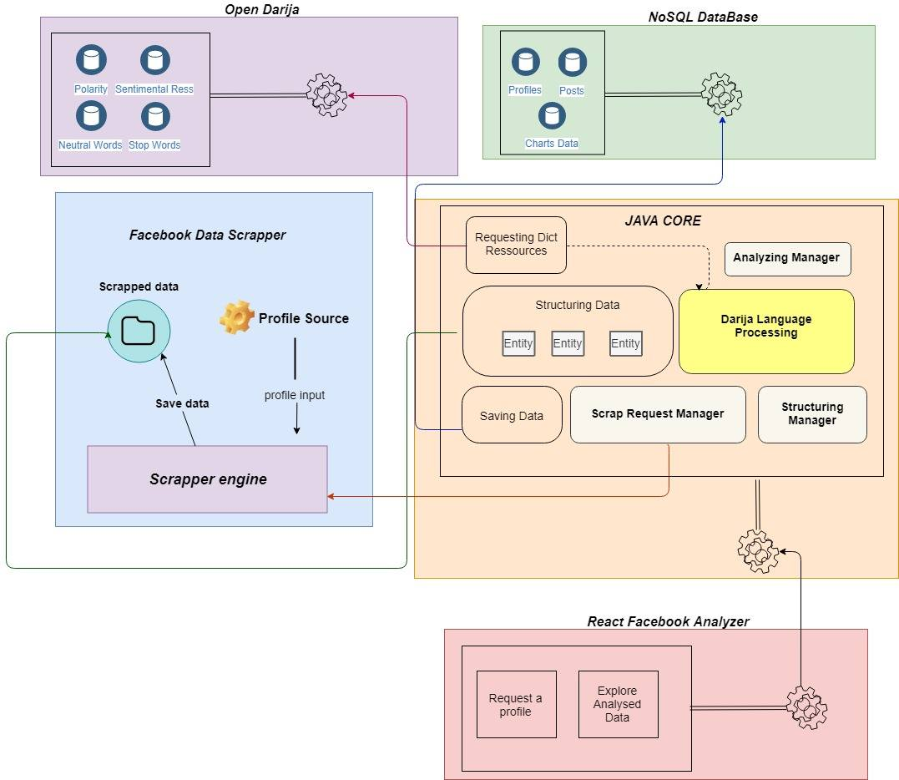
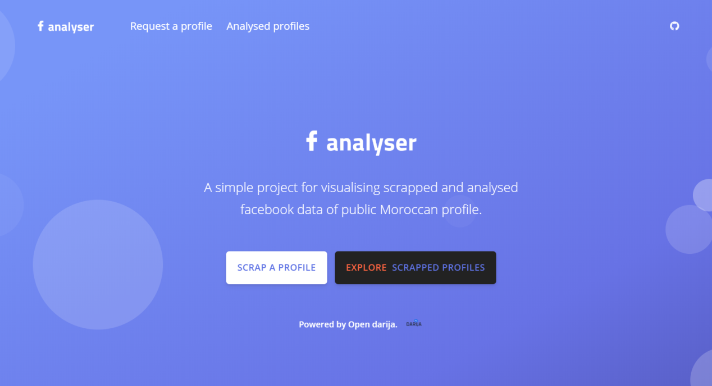

This project is our final year project in our 4th year in school (2nd year of engineering cycle). In fact, open darija was the founded because of this project, since we wanted to be creative in our project, we chose to work on Moroccan's Dialect NLP since it was the first of its kind in Morocco.

The project was to create a web application that is help you to scrape a social media public data, analyse it and classifying the content in order to display it to the user. The project was not commercial, it was a search project, so we displayed the results of the project in a defense in front of jury.

The project is composed with 5 parts:

* Front website for data visualisaton: The front website was developed using ReactJS and ChartJS for vizualising data. The front was connected to the back end with a Rest API that was developed using Rest API. 

* BackEnd Core: this was the core of the application, it contains the TADM (traitement automatique du dialecte marocaine) / NLP algorithms that we developed using JAVA, Scrapping engine that scrape social media data, DB engine that executes queries to mongoDB and save/get data and SpringRest engine that ensure the communication.

* Scrapper engine: In fact, this scrapper was open sourced, so we've modified in order to adapt it to our needs. 

* Open Darija: this was a previous presented project in my portfolio. It's the dictionary that helps us to provide a sentimental analysis for the analysed data.

