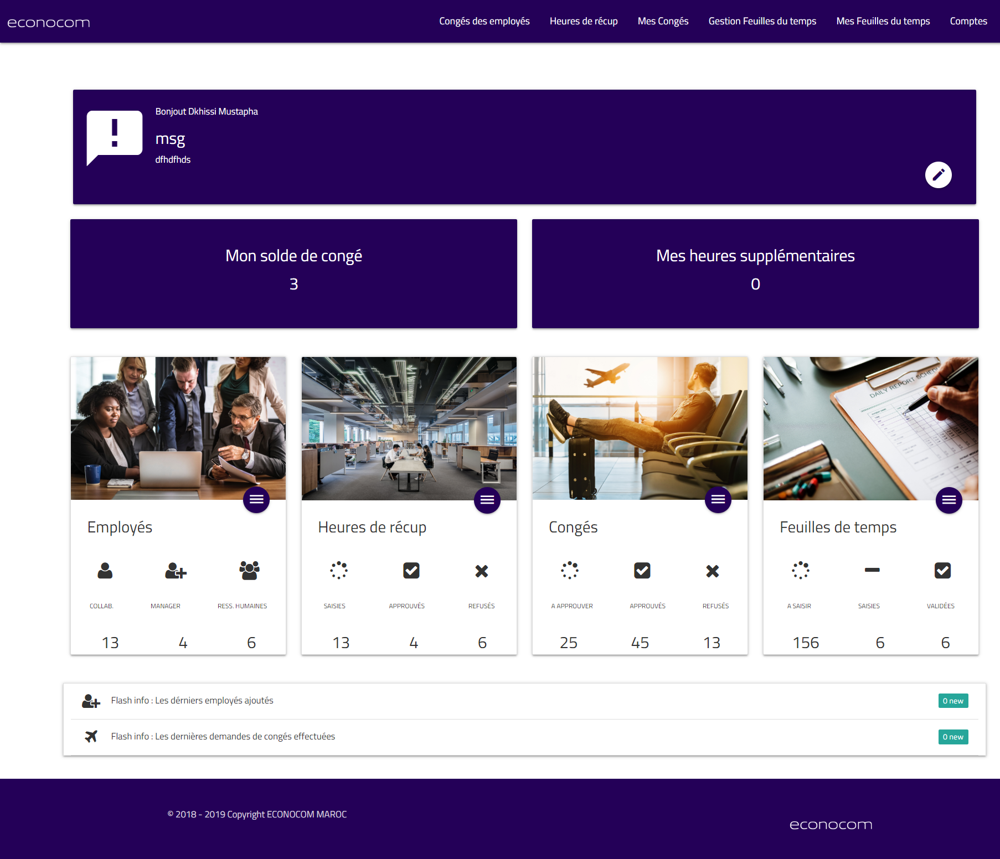
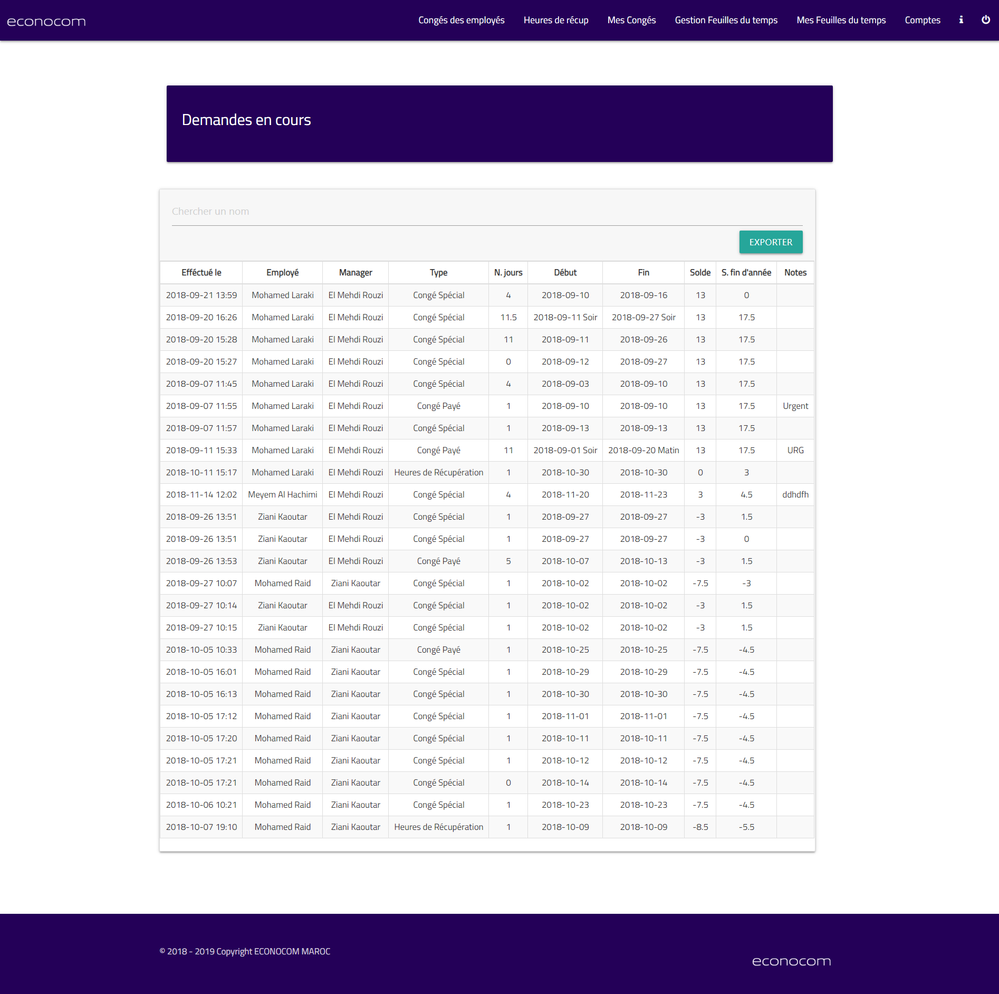
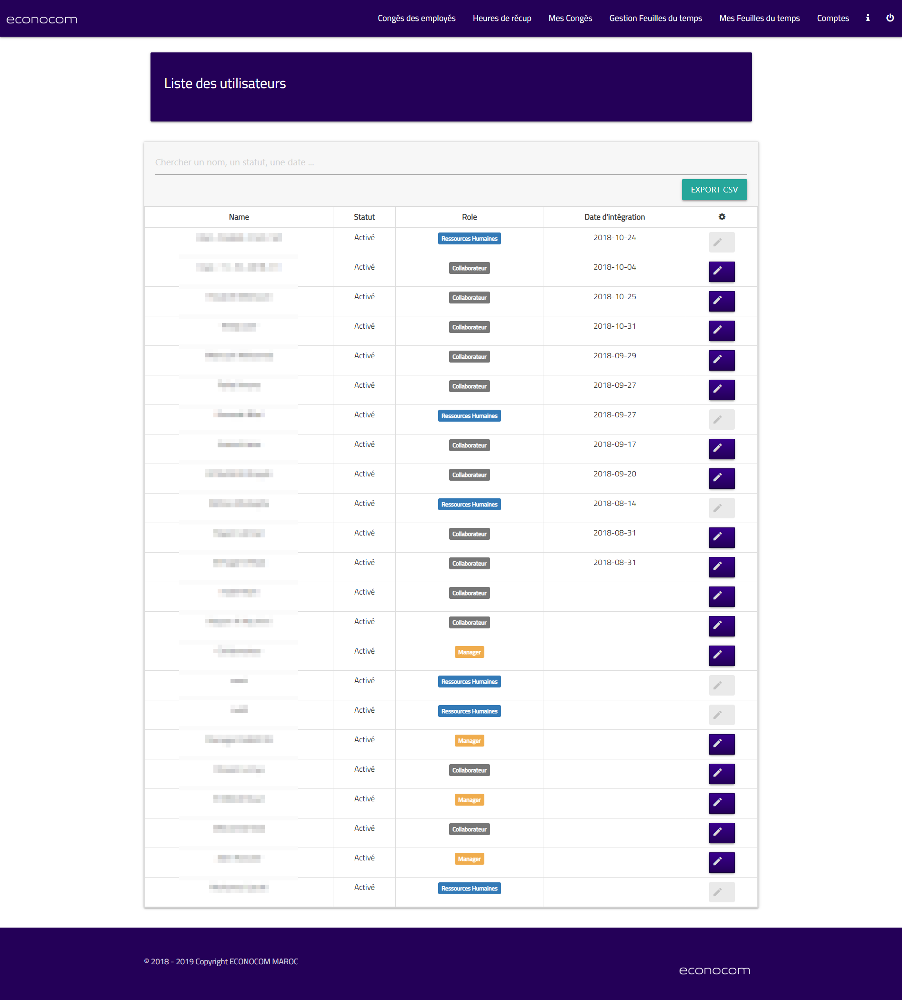

EHM is an application that was developed from scratch for the human resources department of econocom Morocco. The main functionalities was managing leaves requests, employee's timesheets, employees accounts and other services. The app was developed with laravel 5.6 and materializeCSS. 

