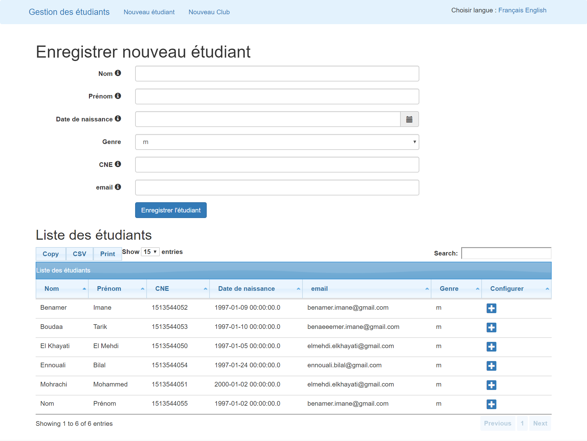
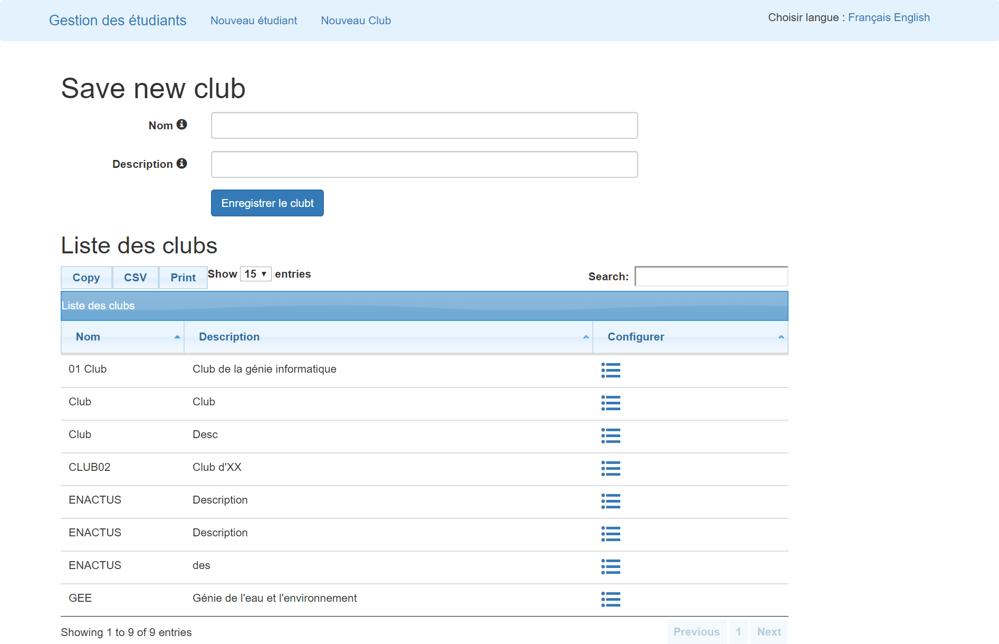
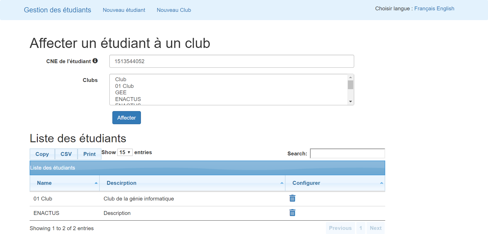

This project was academic, where the mission was to develop a Web JAVA EE app for managing school club's adherents, with an extensible architecture, modular and supports localization and internationalization mecanisms.

