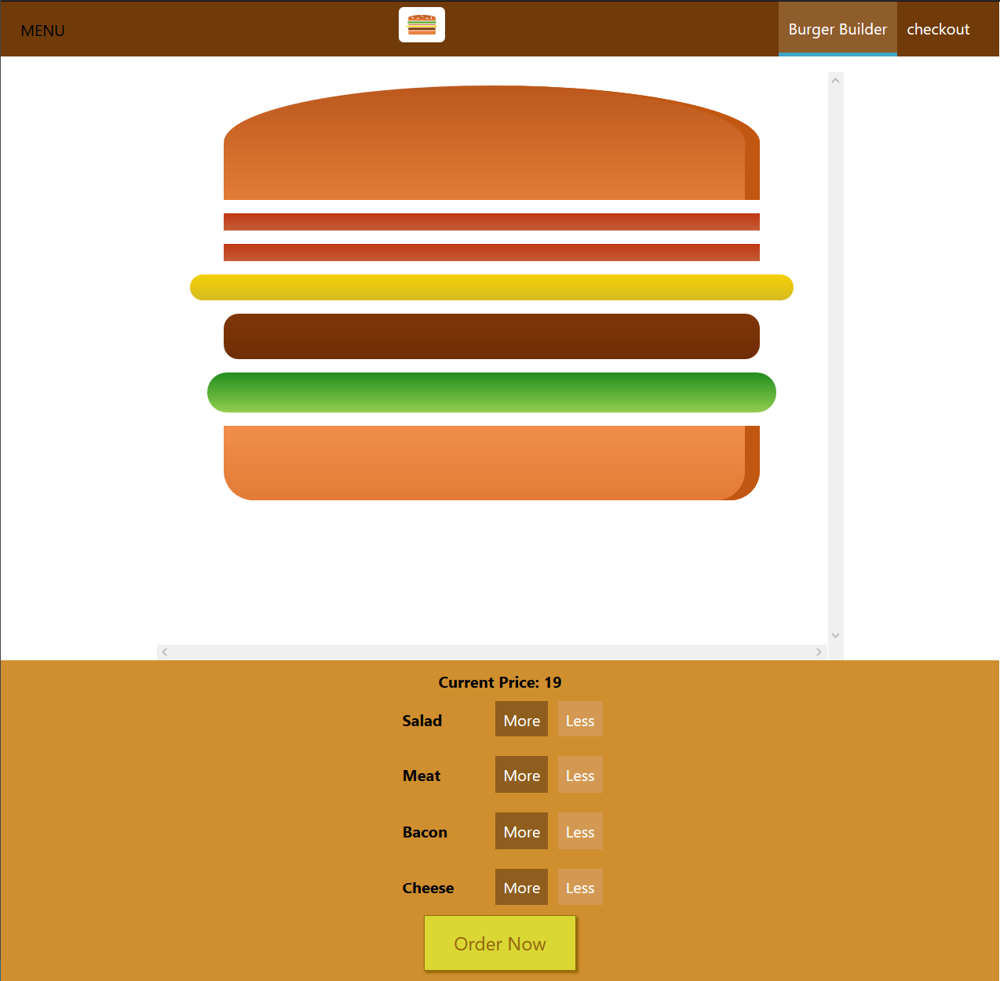

This was a beginner project while I've been learning ReactJS. The project is a simple Burger Builder that makes you build your own burger with your favorite ingredients (bacon, meat, salad ...) and then it shows you the price so you can proceed to purchase. 

The project was built using React 16.8, axios and firebase.

<a href="https://github.com/Kaygi22/React-apps/tree/master/burger-app
"><i class="large github icon"> </i> Check source code </a>

