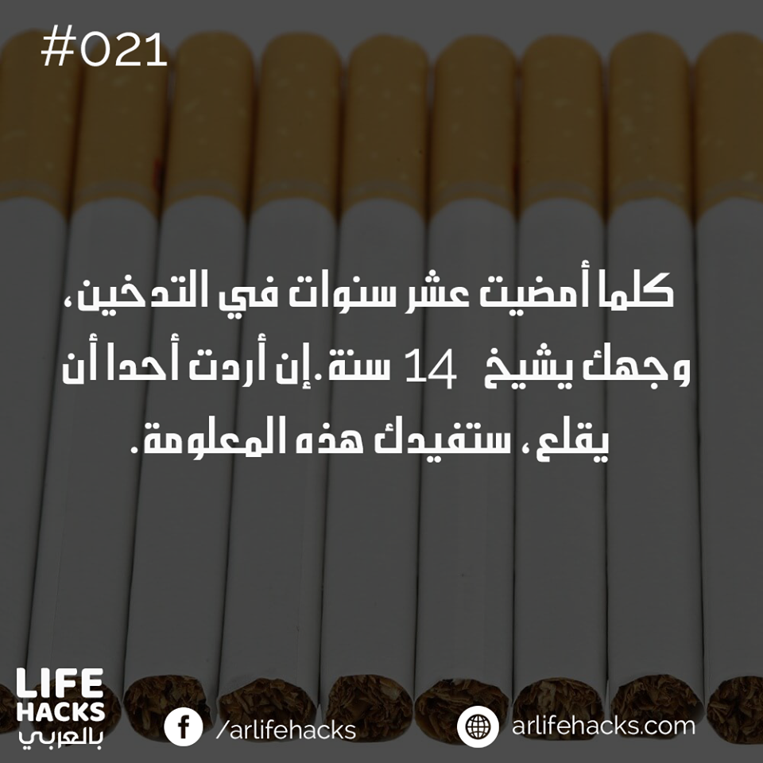
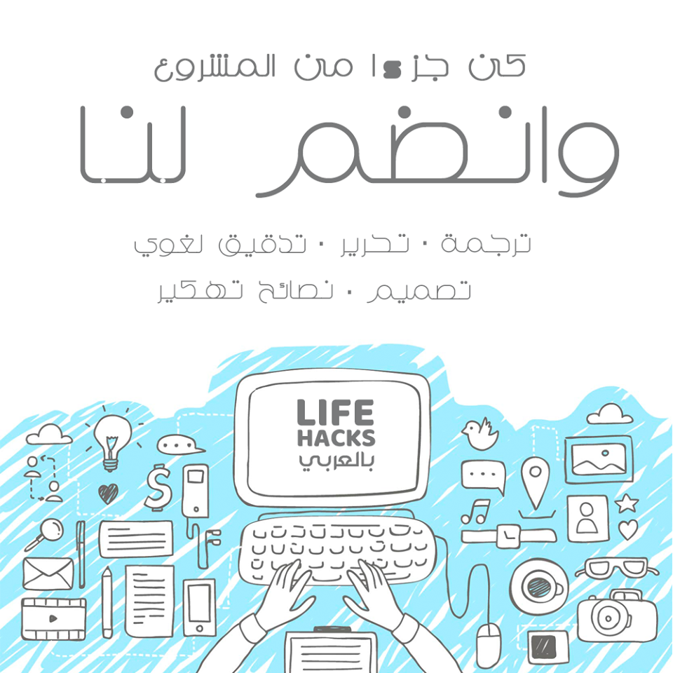
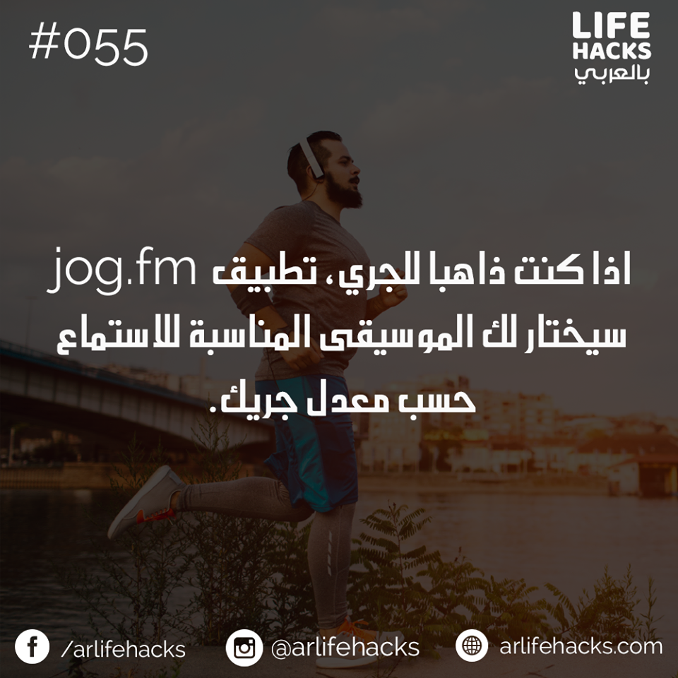
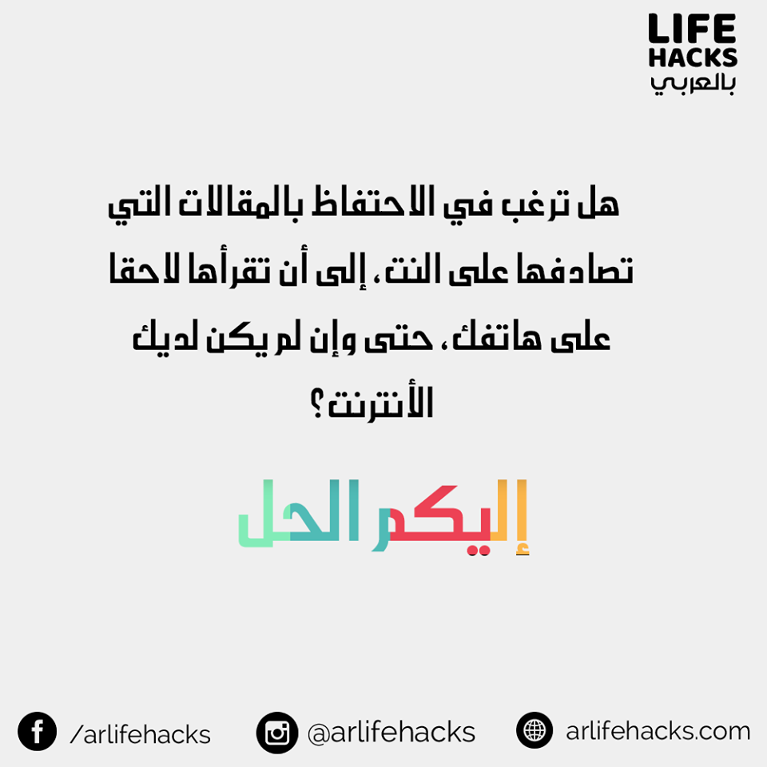

Life hacks - بالعربي was one of my first projects in the web that I've been working on it with a friend of mine. It was lunched on August 2017. It was built with wordpress CMS. The website was a simple blog where we tried, my friend and I, to write some life hacks articles and to design some inforgraphics.

The projects was stopped in December in 2017. Even though the project failed, it was such a great experience.

This project was the first of its kind in the arabic web content.

 <a href="https://www.facebook.com/arlifehacks/"><i class="large facebook icon"> </i>  facebook page </a>

