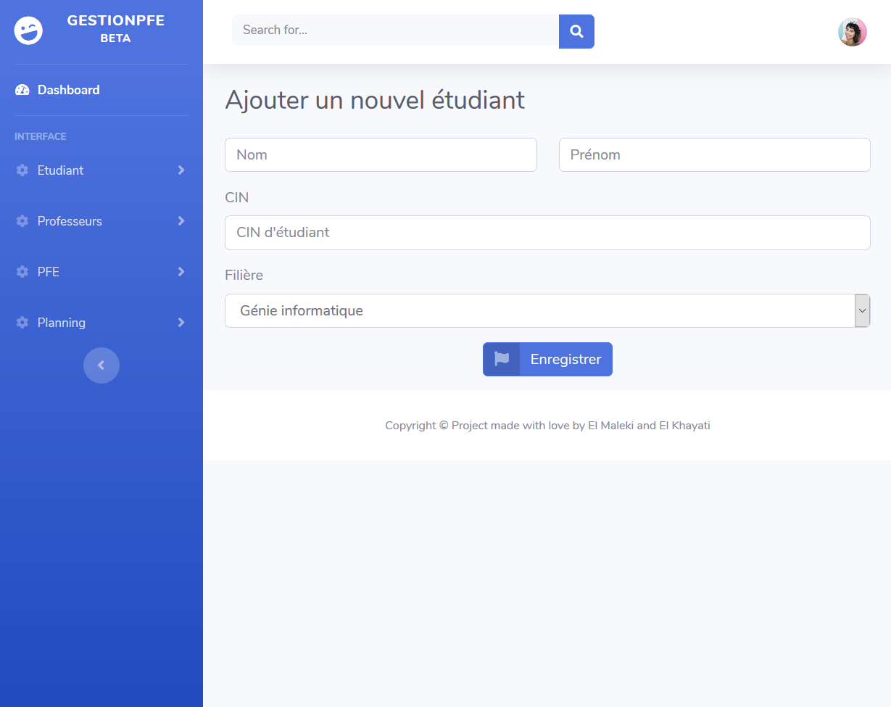

It was an academic project that we've worked on. A CRUD for managing academic final year projects. It was based on DAO Java pattern. 

The project was developed with Java, Spring MVC, Hibernate and bootstrap.

<a href="https://github.com/Kaygi22/Gestion-pfe"><i class="large github icon"> </i> Check gitHub repo.</a>

